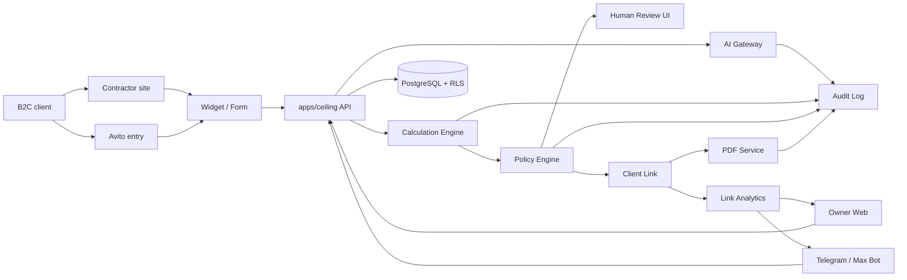

# SolutionDesign.md · ProSmet

Дата: 2026-05-19  
Статус: clean solution design после autonomous MVP feedback  
Методология: AI_M_MSF / Solution Design  
Связано: `Vision.md`, `Scope.md`, `docs/ConceptualDesign.md`, `docs/Architecture.md`, `docs/Domain/DeterministicEstimation.md`, `docs/Evals/QualityGates.md`, `docs/contracts/`

## 1. Цель документа

Solution Design описывает логическую схему компонентов, API, данных и протоколов ProSmet MVP.

Документ отвечает на вопрос:

```text
Как компоненты ProSmet должны взаимодействовать, чтобы выполнить автономный lead-to-estimate Scope?
```

## 2. Архитектурные инварианты

- Канонический B2C flow: entry -> consent -> params/chat -> blurred/partial preview -> phone -> immutable calculation snapshot -> policy/human review -> full link/PDF.
- `packages/core` не содержит потолочную предметку.
- Потолочная предметка живет в `apps/ceiling/domain`.
- Calculation engine является pure module.
- Policy engine является deterministic module.
- AI gateway является единственным путем к LLM.
- LLM payload не содержит ПД, денег, прайсов и PDF со сметой.
- Клиентская ссылка/PDF создаются только после human approval или audited `auto_publish`.
- Предварительный preview может показывать частичную/замыленную смету до телефона; полное раскрытие требует phone-gate, approval/policy и audit.
- Calculation engine умеет возвращать partial estimate: известные строки считаются, неизвестные строки получают статус `insufficient_data`.
- Tenant определяется серверной сессией, а не клиентским `tenantId`.
- Чувствительные таблицы защищены RLS.
- Все события публикации, открытия, скачивания и CTA пишутся в audit/analytics.

## 2.1. Implementation Contracts

Этот документ задает логическую архитектуру. Исполняемые контракты для разработки AI-сотрудниками вынесены в `docs/contracts/`:

- `docs/contracts/API.md` — endpoint contracts, contexts, errors, idempotency и audit events.
- `docs/contracts/DataModelRLS.md` — RLS matrix, `withTenant`, token contexts и tenant-isolation tests.
- `docs/contracts/CalculationEngineV1.md` — типы calculation engine, formula registry, snapshots, audit trail и golden fixtures.
- `docs/contracts/AIGateway.md` — safe schemas, redaction, forbidden fields, fallback и eval corpus.
- `docs/contracts/PublicationPolicy.md` — approval policy, reason codes, publication state machine и link/PDF gates.

Если есть расхождение между нарративом Solution Design и contract-файлом, задача останавливается как architecture-contract drift: сначала обновляется документный контракт или ADR, затем код.

## 3. Component Overview

```text
apps/ceiling
  -> Next.js App Router
  -> Client widget/form UI
  -> Avito entry landing
  -> Owner dashboard
  -> Human review UI
  -> Client estimate link page
  -> API route handlers
  -> ceiling domain adapters

apps/owner-bot
  -> Telegram adapter
  -> Max adapter
  -> notification rendering
  -> quick action callbacks

apps/workers
  -> pdf.generate
  -> client-link-event.ingest
  -> notification.send
  -> ai-payload-audit.flush
  -> price-import.validate
  -> deployment-readiness.check

packages/core
  -> auth/session
  -> tenant/withTenant
  -> db/repositories
  -> rls policies
  -> calculation engine interfaces
  -> policy engine
  -> AI gateway
  -> legal/consent
  -> pricing profile / markup policy
  -> client links
  -> PDF service contracts
  -> channel adapters
  -> notifications
  -> audit/telemetry

packages/ui
  -> shared design primitives
  -> dashboard components
  -> review components
  -> client estimate components

packages/widget-loader
  -> loader.js
  -> iframe bootstrap
  -> postMessage UI protocol

apps/ceiling/domain
  -> CeilingEstimateParams
  -> formula adapters
  -> partial estimate rules
  -> ceiling prompts without prices
  -> risk flag catalog
  -> golden estimate fixtures
  -> variant templates
```

## 4. Component Diagram



## 5. Runtime Contexts

### 5.1. Public client context

Используется для виджета, формы, Avito entry и клиентской ссылки.

Особенности:

- anonymous session;
- tenant определяется сервером по domain/slug/token;
- нельзя доверять `tenantId` из клиента;
- consent обязателен до ПД;
- phone-gate применяется до полного раскрытия сметы и PDF;
- до телефона разрешен preview: часть сметы открыта, итоговые/ценовые блоки замылены по tenant policy;
- доступ только к объектам текущей client session или signed link token.

### 5.2. Owner dashboard context

Используется владельцем, менеджером, сметчиком, администратором tenant.

Особенности:

- authenticated user session;
- tenant из membership;
- role-based permissions поверх RLS;
- доступ к ПД только там, где это нужно роли;
- любое чтение original PII пишет `pii_access_log`.

### 5.3. Worker context

Используется фоновой обработкой.

Особенности:

- каждая задача содержит tenant scope;
- worker открывает DB-транзакцию через `withTenant`;
- idempotency key обязателен для событий ссылок, PDF и уведомлений;
- worker не вызывает LLM вне AI gateway.

## 6. API Surface

### 6.1. Public intake API

- `POST /api/session` — создать anonymous session, определить tenant по origin/domain/entry token.
- `POST /api/consent` — записать согласие и legal document version.
- `POST /api/leads` — создать лид после consent gate.
- `POST /api/leads/:id/contact` — записать телефон/контакт после consent.
- `POST /api/leads/:id/params` — сохранить структурные ответы формы.
- `POST /api/ai/collect-params` — собрать/уточнить параметры через AI gateway.
- `POST /api/calculations/preview` — создать partial/complete preview calculation из текущих параметров.
- `POST /api/calculations` — создать immutable calculation snapshot для publication workflow.
- `POST /api/calculations/:id/policy-decision` — выполнить или вернуть deterministic decision.
- `POST /api/client-links/:token/unlock` — открыть полную смету после phone-gate и publication gates.
- `GET /api/client-links/:token` — открыть клиентскую ссылку.
- `POST /api/client-links/:token/events` — записать opening/download/CTA event.

### 6.2. Owner dashboard API

- `POST /api/auth/signin` — magic-link или выбранный auth flow.
- `GET /api/dashboard/leads` — список заявок tenant.
- `GET /api/dashboard/leads/:id` — карточка заявки.
- `PATCH /api/dashboard/leads/:id/status` — сменить статус сделки.
- `GET /api/dashboard/calculations/:id` — расчет, строки, snapshot, audit.
- `POST /api/dashboard/calculations/:id/approve` — human approval.
- `POST /api/dashboard/calculations/:id/request-clarification` — вернуть на уточнение.
- `POST /api/dashboard/calculations/:id/requires-measurement` — отправить на замер.
- `POST /api/dashboard/calculations/:id/manual-adjustment` — ручная правка с причиной.
- `GET /api/dashboard/client-events` — события ссылок и PDF.
- `GET /api/dashboard/analytics/summary` — минимальная воронка.
- `GET /api/dashboard/settings/readiness` — готовность price/legal/policy/autonomous mode.
- `POST /api/dashboard/settings/price-imports` — загрузить прайс tenant.
- `GET /api/dashboard/settings/price-imports/:id` — статус валидации прайса.
- `PATCH /api/dashboard/settings/pricing-profile` — наценки, минимальная стоимость, округления, срок действия.
- `PATCH /api/dashboard/settings/autonomous-mode` — включить/выключить autonomous offer mode.
- `POST /api/notifications/test` — проверить канал уведомлений.

### 6.3. PDF API

- `POST /api/pdf` — поставить PDF job для approved или auto-published calculation.
- `GET /api/pdf/:jobId` — статус генерации.
- `GET /api/pdf-assets/:assetId/download` — скачать PDF через link token или owner session.

### 6.4. Owner bot API

- `POST /api/bot/telegram/webhook` — Telegram webhook.
- `POST /api/bot/max/webhook` — Max webhook.
- `POST /api/bot/actions` — callback быстрых действий.

Bot API не принимает tenant из callback как доверенный источник. Tenant выводится из подписанного callback token и server-side binding.

## 7. Data Model

### 7.1. Tenant and auth

`tenants`

- `id`
- `slug`
- `name`
- `status`
- `default_region_id`
- `created_at`

`tenant_domains`

- `id`
- `tenant_id`
- `domain`
- `allowed_origin`
- `status`

`users`

- `id`
- `email`
- `phone`
- `name`
- `status`

`memberships`

- `id`
- `tenant_id`
- `user_id`
- `role`
- `status`

`sessions`

- `id`
- `tenant_id`
- `user_id`
- `client_session_id`
- `kind`
- `expires_at`

### 7.2. Tenant settings

`tenant_settings`

- `tenant_id`
- `phone_gate_enabled`
- `autonomous_offer_enabled`
- `default_policy_profile_id`
- `notification_policy`
- `client_link_ttl_days`
- `preview_reveal_policy`
- `pdf_required_for_publish`

`tenant_pricing_profiles`

- `id`
- `tenant_id`
- `price_book_id`
- `coefficient_set_id`
- `markup_policy_id`
- `minimum_order_amount_minor`
- `rounding_policy`
- `estimate_validity_days`
- `measurement_fee_policy`
- `status`

`markup_policies`

- `id`
- `tenant_id`
- `name`
- `global_markup_percent`
- `category_markup_json`
- `margin_floor_percent`
- `discount_policy_json`
- `status`

`approval_policy_profiles`

- `id`
- `tenant_id`
- `policy_version`
- `min_ai_confidence`
- `min_completeness_for_full_publish`
- `min_completeness_for_partial_publish`
- `blocking_risk_flags`
- `measurement_risk_flags`
- `requires_review_risk_flags`
- `allow_partial_auto_publish`
- `status`

`notification_channels`

- `id`
- `tenant_id`
- `channel`
- `external_chat_id_hash`
- `status`
- `last_verified_at`

### 7.3. Lead and client

`clients`

- `id`
- `tenant_id`
- `phone_encrypted`
- `name_encrypted`
- `email_encrypted`
- `created_at`

`leads`

- `id`
- `tenant_id`
- `client_id`
- `source_id`
- `status`
- `deal_status`
- `created_at`
- `last_activity_at`

`lead_sources`

- `id`
- `tenant_id`
- `channel`
- `source_url`
- `campaign`
- `entry_token_hash`

`acquisition_sessions`

- `id`
- `tenant_id`
- `lead_id`
- `channel`
- `origin`
- `referrer`
- `utm`
- `created_at`

`consent_records`

- `id`
- `tenant_id`
- `client_id`
- `lead_id`
- `legal_document_id`
- `legal_document_version`
- `accepted_at`
- `ip_hash`
- `user_agent_hash`

### 7.4. Conversation and AI

`conversations`

- `id`
- `tenant_id`
- `lead_id`
- `channel`
- `status`

`messages`

- `id`
- `tenant_id`
- `conversation_id`
- `direction`
- `content_encrypted`
- `content_sanitized`
- `pii_detected`
- `money_detected`
- `created_at`

`ai_payload_audit`

- `id`
- `tenant_id`
- `lead_id`
- `purpose`
- `input_hash`
- `sanitized_payload_hash`
- `forbidden_fields_detected`
- `model`
- `status`
- `created_at`

### 7.5. Ceiling params and calculation

`rooms`

- `id`
- `tenant_id`
- `lead_id`
- `room_type`
- `area_sqm`
- `shape`
- `height_m`
- `params_json`

`calculation_inputs`

- `id`
- `tenant_id`
- `lead_id`
- `room_id`
- `normalized_params_json`
- `missing_fields`
- `assumptions`
- `risk_flags`
- `ai_confidence`
- `completeness_score`
- `known_fields`
- `input_hash`

`calculations`

- `id`
- `tenant_id`
- `lead_id`
- `room_id`
- `calculation_input_id`
- `formula_version`
- `price_book_id`
- `price_book_version`
- `price_book_hash`
- `coefficient_snapshot_hash`
- `input_hash`
- `snapshot_json`
- `completeness_status`
- `completeness_score`
- `missing_blocks`
- `status`
- `created_at`

`calculation_items`

- `id`
- `tenant_id`
- `calculation_id`
- `variant_id`
- `kind`
- `label`
- `quantity`
- `unit`
- `unit_price_minor`
- `amount_minor`
- `calculation_status`
- `insufficient_data_reason`
- `source_ref`
- `audit_json`

`estimate_variants`

- `id`
- `tenant_id`
- `calculation_id`
- `code`
- `label`
- `total_minor`
- `currency`
- `summary_json`

### 7.6. Policy, publication, analytics

`approval_policy_decisions`

- `id`
- `tenant_id`
- `lead_id`
- `calculation_id`
- `policy_profile_id`
- `policy_version`
- `decision`
- `reason_codes`
- `input_hash`
- `risk_flags`
- `ai_confidence`
- `legal_pack_version`
- `decided_at`

`human_reviews`

- `id`
- `tenant_id`
- `calculation_id`
- `reviewer_user_id`
- `decision`
- `reason`
- `created_at`

`client_estimate_links`

- `id`
- `tenant_id`
- `lead_id`
- `calculation_id`
- `token_hash`
- `status`
- `expires_at`
- `created_by_decision_id`
- `created_by_review_id`

`client_link_events`

- `id`
- `tenant_id`
- `client_estimate_link_id`
- `lead_id`
- `event_type`
- `event_idempotency_key`
- `occurred_at`
- `ip_hash`
- `user_agent_hash`
- `metadata_json`

`pdf_assets`

- `id`
- `tenant_id`
- `lead_id`
- `calculation_id`
- `client_estimate_link_id`
- `status`
- `storage_key`
- `content_hash`
- `created_by_decision_id`
- `created_by_review_id`

### 7.7. Pricing and legal

`price_books`

- `id`
- `tenant_id`
- `vertical`
- `version`
- `hash`
- `status`
- `valid_from`

`price_imports`

- `id`
- `tenant_id`
- `uploaded_by_user_id`
- `source_file_asset_id`
- `detected_columns_json`
- `column_mapping_json`
- `validation_errors_json`
- `status`
- `created_at`

`price_items`

- `id`
- `tenant_id`
- `price_book_id`
- `sku`
- `kind`
- `unit`
- `price_minor`
- `currency`
- `metadata_json`

`coefficient_sets`

- `id`
- `tenant_id`
- `version`
- `hash`
- `coefficients_json`

`deployment_environments`

- `id`
- `kind`
- `jurisdiction`
- `personal_data_allowed`
- `database_region`
- `object_storage_region`
- `logs_region`
- `status`

`legal_documents`

- `id`
- `tenant_id`
- `kind`
- `version`
- `content_hash`
- `status`

`legal_packs`

- `id`
- `tenant_id`
- `version`
- `documents_json`
- `status`

### 7.8. Notifications, deal, audit

`notifications`

- `id`
- `tenant_id`
- `lead_id`
- `channel`
- `kind`
- `payload_json`
- `status`
- `sent_at`

`deals`

- `id`
- `tenant_id`
- `lead_id`
- `status`
- `next_step`
- `next_step_at`
- `closed_reason`

`audit_log`

- `id`
- `tenant_id`
- `actor_type`
- `actor_id`
- `event_type`
- `entity_type`
- `entity_id`
- `payload_hash`
- `created_at`

`pii_access_log`

- `id`
- `tenant_id`
- `user_id`
- `entity_type`
- `entity_id`
- `reason`
- `created_at`

## 8. Sequence Flow MVP-0

```mermaid
sequenceDiagram
  actor Manager
  participant UI as Owner Dashboard
  participant API as Ceiling API
  participant Calc as Calculation Service
  participant Engine as Calculation Engine
  participant DB as PostgreSQL/RLS
  participant Review as Human Review
  participant Link as Client Link/PDF

  Manager->>UI: Create lead manually
  UI->>API: POST /api/leads
  API->>DB: Insert lead with tenant context
  Manager->>UI: Enter room params
  UI->>API: POST /api/calculations
  API->>Calc: Build CalculationInput
  Calc->>Engine: calculateEstimate(input)
  Engine-->>Calc: CalculationResult + auditTrail
  Calc->>DB: Save immutable snapshot
  UI->>Review: Show lines, versions, warnings
  Manager->>API: POST /approve
  API->>DB: Save human review approval
  API->>Link: Create link and/or PDF job
  Link->>DB: Save publication artifacts
```

## 9. Sequence Flow MVP-1

```mermaid
sequenceDiagram
  actor Client
  participant Widget as Site Widget / Avito Entry
  participant API as Public API
  participant Legal as Consent Service
  participant AI as AI Gateway
  participant Calc as Calculation Service
  participant Review as Human Review UI
  participant Link as Client Link/PDF
  participant Notify as Notification Service
  participant Owner as Owner Web/Bot

  Client->>Widget: Opens form
  Widget->>API: POST /api/session
  API-->>Widget: Anonymous session
  Client->>Widget: Accepts consent
  Widget->>Legal: POST /api/consent
  Legal-->>Widget: Consent recorded
  Client->>Widget: Enters params in chat UI
  Widget->>API: POST /api/leads and /params
  Widget->>AI: POST /api/ai/collect-params
  AI-->>Widget: normalized params, missing fields, confidence, risk flags
  Widget->>Calc: POST /api/calculations/preview
  Calc-->>Widget: blurred/partial preview
  Client->>Widget: Enters phone to unlock full estimate
  Widget->>API: POST /api/leads/:id/contact
  Widget->>Calc: POST /api/calculations
  Calc-->>Review: immutable calculation snapshot ready
  Review->>Calc: human approval
  Calc->>Link: create client link and PDF
  Link-->>Client: unique estimate link
  Link->>Notify: lead/offer notification
  Notify-->>Owner: web and bot notification
```

## 10. Sequence Flow MVP-2 Autonomous Offer Mode

```mermaid
sequenceDiagram
  actor Client
  participant Entry as Site Widget / Avito Entry
  participant API as Public API
  participant AI as AI Gateway
  participant Calc as Calculation Engine
  participant Policy as Approval Policy Service
  participant Link as Client Link Service
  participant PDF as PDF Worker
  participant Events as Link Analytics
  participant Notify as Notification Service
  participant Owner as Owner Web/Bot

  Client->>Entry: Opens entry
  Entry->>API: POST /api/session
  Client->>Entry: Consent + params in chat UI
  Entry->>API: POST consent, lead, params
  API->>AI: collect/normalize params through gateway
  AI-->>API: safe structured params + confidence + risk flags
  API->>Calc: calculateEstimate(preview input)
  Calc-->>API: partial/complete preview with insufficient_data lines
  API-->>Entry: blurred preview
  Client->>Entry: Enters phone to unlock
  Entry->>API: POST /contact
  API->>Calc: create immutable calculation snapshot
  Calc-->>API: partial/complete immutable snapshot
  API->>Policy: decide(snapshot, legal, phoneGate, confidence, risks)
  Policy-->>API: auto_publish with publicationMode
  API->>Link: create signed client link
  API->>PDF: enqueue PDF generation
  API->>Notify: enqueue owner notification
  Link-->>Client: offer URL
  Client->>Events: open/download/CTA
  Events->>Notify: important client event
  Notify-->>Owner: web and bot updates
```

## 11. Approval Policy Protocol

### 11.1. Input contract

```ts
type ApprovalPolicyInput = {
  tenantId: string;
  leadId: string;
  calculationId: string;
  calculationSnapshotHash: string;
  policyProfileId: string;
  policyVersion: string;
  requiredFields: {
    name: string;
    present: boolean;
  }[];
  completeness: {
    status: "partial" | "complete" | "unusable";
    score: number;
    missingBlocks: string[];
  };
  aiConfidence: number | null;
  aiRiskFlags: string[];
  calculationRiskFlags: string[];
  missingFields: string[];
  contradictions: string[];
  consent: {
    accepted: boolean;
    legalDocumentVersion: string | null;
  };
  phoneGate: {
    enabled: boolean;
    phoneCollected: boolean;
  };
  tenantReadiness: {
    autonomousOfferEnabled: boolean;
    priceBookReady: boolean;
    pricingProfileReady: boolean;
    formulaReady: boolean;
    legalPackReady: boolean;
    notificationChannelReady: boolean;
  };
  manualAdjustments: {
    exists: boolean;
  };
};
```

### 11.2. Decision contract

```ts
type ApprovalPolicyDecision =
  | {
      decision: "auto_publish";
      publicationMode: "full" | "partial";
      reasonCodes: string[];
      publishable: true;
    }
  | {
      decision: "requires_review";
      reasonCodes: string[];
      publishable: false;
    }
  | {
      decision: "requires_measurement";
      reasonCodes: string[];
      publishable: false;
    }
  | {
      decision: "reject_as_incomplete";
      reasonCodes: string[];
      publishable: false;
    };
```

### 11.3. Decision order

1. Reject if calculation snapshot is missing or mutable.
2. Reject only if calculation completeness is `unusable`.
3. Reject if consent is missing.
4. Block full publication if phone-gate is enabled and phone is missing; preview may remain visible.
5. Require review if tenant autonomous mode is disabled.
6. Require review if price/pricing profile/formula/legal/notification readiness is incomplete.
7. Require measurement for measurement risk flags.
8. Require review for review risk flags, contradictions or manual adjustments.
9. Require review if AI confidence is below profile threshold.
10. Auto publish with `publicationMode = full` when completeness is complete.
11. Auto publish with `publicationMode = partial` only if tenant policy allows partial publication and missing blocks are explicitly visible as "недостаточно данных".

### 11.4. Initial policy profile

До пилотной калибровки используется консервативный profile:

- `min_ai_confidence`: `0.90`;
- any contradiction -> `requires_review`;
- unusable calculation -> `reject_as_incomplete`;
- partial calculation below tenant completeness threshold -> `requires_review`;
- partial calculation above threshold and without blocking flags -> `auto_publish` with `publicationMode = partial`;
- complex geometry without perimeter -> `requires_measurement`;
- height above supported threshold -> `requires_measurement`;
- 8+ corners without perimeter -> `requires_measurement`;
- more than 20 spotlights -> `requires_review`;
- fabric with flooding history -> `requires_review`;
- individual discount request -> `requires_review`;
- commercial object -> `requires_review` or `requires_measurement` by profile.

Понижение threshold или ослабление blocking flags требует отдельного архитектурного решения или пилотной приемки.

## 12. Calculation Engine Protocol

```ts
type CalculateEstimate = (input: CalculationInput) => CalculationResult;
```

Constraints:

- no LLM calls;
- no DB reads;
- no network calls;
- no current time except explicit `calculationDate`;
- no random;
- no float money;
- no hidden mutable globals.

Input:

- normalized ceiling params;
- price book snapshot;
- coefficient snapshot;
- tenant pricing profile;
- markup policy snapshot;
- formula version;
- calculation date.

Output:

- variants;
- line items;
- line item calculation statuses: `calculated` or `insufficient_data`;
- completeness status: `complete`, `partial` or `unusable`;
- completeness score;
- missing blocks;
- warnings;
- assumptions;
- calculation risk flags;
- audit trail;
- hashes and versions.

The service layer, not the engine, loads snapshots from DB and persists the result.

Partial estimate rules:

- known lines are calculated deterministically;
- unknown lines are present as placeholders with `insufficient_data_reason`;
- totals may be marked as partial if any amount-bearing block is unknown;
- UI must not pretend a partial total is final;
- PDF/client link must show missing blocks plainly.

## 13. AI Gateway Protocol

```text
raw input
  -> legal basis check
  -> PII detection
  -> PII redaction
  -> money redaction
  -> schema guarded prompt
  -> provider call
  -> structured output validation
  -> forbidden field rejection
  -> audit
```

Forbidden AI output fields:

- `price`;
- `priceRub`;
- `finalPrice`;
- `discount`;
- `margin`;
- `coefficientValue`;
- `estimateLineAmount`;
- `total`.

Allowed AI output:

- normalized params;
- missing fields;
- clarification questions;
- assumptions;
- contradictions;
- risk flags;
- confidence;
- explanation text without money.

## 14. Client Link and PDF Analytics

### 14.1. Link creation

Client link is created only from:

- `human_reviews.decision = approve`; or
- `approval_policy_decisions.decision = auto_publish`.

The link stores:

- token hash, never raw token;
- tenant id;
- lead id;
- calculation id;
- expiration;
- publication source;
- status.

### 14.2. Event protocol

`POST /api/client-links/:token/events`

Accepted events:

- `preview_shown`;
- `phone_submitted`;
- `opened`;
- `reopened`;
- `pdf_downloaded`;
- `cta_clicked`;
- `expired_link_opened`.

Rules:

- preview writes `preview_shown` without full price/PDF exposure;
- phone-gate completion writes `phone_submitted`;
- first page view writes `opened`;
- repeat page view writes `reopened` or increments repeat counter with audit;
- PDF download writes `pdf_downloaded`;
- CTA writes `cta_clicked`;
- expired token writes `expired_link_opened` without revealing estimate details;
- events use idempotency keys to avoid duplicate spam;
- IP/user-agent are hashed;
- event metadata must not include raw PII.

### 14.3. Owner analytics

Dashboard aggregates:

- preview to phone conversion;
- link open rate;
- reopen count;
- PDF download rate;
- CTA click rate;
- time from lead to estimate;
- time from estimate to first open;
- source/channel performance.

## 15. Site Widget Protocol

MVP uses iframe widget with loader.

Flow:

```text
contractor site
  -> loads loader.js with public tenant slug
  -> loader creates iframe
  -> iframe requests session
  -> server validates origin and tenant domain
  -> widget shows chat with quick replies and custom input
  -> widget collects consent and params
  -> API creates partial/complete blurred preview
  -> widget asks phone to unlock
  -> API creates lead/calculation/policy decision and full link
```

Rules:

- `loader.js` may contain public tenant slug only;
- `Origin` and `parentUrl` are validated against `tenant_domains`;
- `postMessage` is only for UI height, close, progress and non-sensitive events;
- API ignores tenant from `postMessage`, query body and localStorage;
- widget can be disabled per tenant/domain;
- widget errors create non-PII diagnostic events.

## 16. Avito Entry Protocol

MVP Avito entry is not a deep integration.

Allowed entry formats:

- unique link in listing text;
- QR code leading to ProSmet landing;
- short landing URL;
- manual link sent by owner.

Flow:

```text
Avito listing/message
  -> ProSmet entry URL with signed public entry token
  -> server resolves tenant and source
  -> client gives consent
  -> client completes params in chat UI
  -> client sees blurred preview
  -> client gives phone to unlock
  -> calculation and policy flow continues
```

Rules:

- source channel is `avito`;
- entry token does not expose tenant id;
- consent required before PII;
- phone required before full estimate/PDF, not before blurred preview;
- Avito text is treated as untrusted free input;
- no PII goes to AI before consent/redaction;
- same downstream policy gates as site widget.

## 17. Owner Bot Notifications

### 17.1. Notification types

- `lead_created`;
- `params_completed`;
- `calculation_ready`;
- `auto_published`;
- `requires_review`;
- `requires_measurement`;
- `client_opened_link`;
- `client_reopened_link`;
- `pdf_downloaded`;
- `cta_clicked`;
- `pdf_failed`;
- `notification_failed`.

### 17.2. Payload rules

Bot notification can include:

- lead id or short public code;
- source channel;
- status;
- safe summary;
- next action;
- link to dashboard.

Bot notification must not include:

- raw phone unless role and template allow it;
- address unless explicitly needed;
- full original client text;
- hidden tenant identifiers;
- AI payload;
- price details beyond approved offer summary templates.

### 17.3. Quick actions

Allowed quick actions:

- open dashboard link;
- acknowledge notification;
- mark callback needed;
- move to `requires_measurement`;
- approve only if action requires signed owner auth and full review context is available;
- disable auto-publish for the lead.

Risky actions should deep-link to web review instead of being completed inside chat.

## 18. RLS and Security

### 18.1. Tenant resolution

```text
Request
  -> server session / signed link / entry token
  -> tenant context
  -> withTenant
  -> RLS protected query
```

Rules:

- never trust `tenantId` from client;
- app DB role has no `BYPASSRLS`;
- sensitive tables have `tenant_id`;
- background jobs carry tenant scope;
- signed tokens resolve to server-side rows;
- cross-tenant access is covered by tests.

### 18.2. Sensitive data

Original PII:

- encrypted at rest;
- accessed only by role-specific UI/service;
- every access writes `pii_access_log`.

Sanitized data:

- can be used for AI;
- stored separately;
- does not include phone, name, email, address, money.

### 18.3. Token policy

- client link stores token hash only;
- raw token is shown once in URL;
- tokens are high entropy;
- expiration is required;
- revoked links return safe expired state.

## 19. Publication Protocol

```text
calculation snapshot
  -> human approval OR auto_publish policy decision
  -> create client link
  -> enqueue PDF
  -> write audit
  -> update deal status
  -> notify owner
```

Publication fails closed if:

- calculation snapshot is mutable;
- legal phrase is missing;
- price/formula version is missing;
- pricing profile or markup snapshot is missing;
- policy decision is absent;
- human approval is absent and decision is not `auto_publish`;
- phone-gate is enabled and full unlock has no phone;
- tenant is inactive;
- link token generation fails;
- PDF cannot be queued and tenant requires PDF at publish time.

## 20. Error and Fallback Behavior

- AI unavailable: form continues with manual structured questions; lead may require review.
- PDF worker unavailable: link can show web estimate; PDF status is pending/failed based on tenant policy.
- Bot unavailable: notification remains in web dashboard and retry queue.
- Avito token invalid: show safe entry error without tenant/private data.
- Consent missing: block PII collection and estimate publication.
- Phone missing: allow blurred preview, block full unlock/PDF when phone-gate is enabled.
- Price book missing: allow only skeleton estimate with "недостаточно данных", block autonomous mode readiness.
- Pricing profile missing: block full publication and autonomous mode readiness.
- Policy engine error: fail closed to `requires_review`.

## 21. Quality Gates

Before implementation moves beyond architecture documents:

- Conceptual Design and Solution Design are aligned with `Scope.md`.
- ADR-003 and ADR-007 are consistent.
- Approval policy has a deterministic protocol.
- Phone-gate has an explicit protocol.
- Partial estimate has explicit UI and data semantics.
- Site widget and Avito entry do not trust tenant from client.
- Owner bot does not become a hidden unsafe approval channel.
- RF deployment/data residency decision is captured before real PII goes to production.

Before MVP-0:

- calculation golden estimates exist;
- deterministic calculation tests exist;
- human review flow works.

Before MVP-1:

- consent and phone-gate work;
- blurred preview before phone works;
- client link/PDF analytics work;
- site/Avito entry path works under review;
- AI payload audit works.

Before MVP-2:

- `auto_publish` tests cover every blocking gate;
- risky leads fail to review/measurement;
- publication always has audit;
- owner notification is queued;
- client link/PDF are generated from immutable snapshot;
- partial publication clearly marks insufficient-data blocks and never presents partial totals as final.

## 22. Deployment and RF Data Residency

Development environments:

- local development can use synthetic/test data only;
- VPS can be used for engineering or controlled pilot, but real PII requires separate approval of jurisdiction, contracts and storage region;
- production must be deployable to Russian DB, object storage, logging and backup infrastructure.

Production requirements before public launch:

- PostgreSQL in РФ jurisdiction;
- PDF/object storage in РФ jurisdiction;
- logs and backups in РФ jurisdiction;
- secrets managed outside repository;
- AI payload audit proves PII and money are redacted before model calls;
- migration plan from local/VPS to РФ infrastructure;
- retention and deletion policy for PII;
- incident/audit access process for tenant data.
